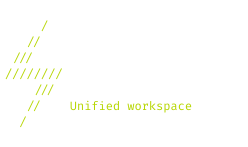

ARC is a seamless server-client workflow tool where the local machine is treated as a thin client by default.

## Feature Highlights

- Thin-client-first workflow:
  - local machine is primarily an access/control node,
  - the main runtime context is a remote tmux session.

- Session-centric remote flow (`sw`, `sl`, `x`):
  - on local:
  - `sw` attaches/creates remote tmux session `arc`,
  - `sw <name>` attaches/creates named remote tmux session,
  - `sl` lists remote tmux sessions,
  - `x` (or `x <name>`) kills remote tmux session (`arc` by default),
  - connection target is always `arc@remotehost`.
  - on remote:
  - `sw` detaches current tmux client (keeps session alive),
  - `sw <name>` switches to named tmux session (creates it if missing),
  - `sl` lists tmux sessions on the host,
  - `x` kills current tmux session, `x <name>` kills named session.

- Automatic handoff on local Zsh start:
  - on first interactive local shell startup, ARC attempts to auto-connect to the remote `ARC` shell,
  - connection target: `arc@remotehost`.

- Local hosts alias management:
  - updates local hosts mappings for `remotehost`,
  - keeps the WireGuard SSH target stable for seamless switching and auto-connect behavior.

- WireGuard-only remote access strategy:
  - local ARC access uses the private/WireGuard path (`remotehost`) only.

- NFS-backed remote home:
  - remote exports `/home/arc` via NFS (WireGuard-only access scope),
  - local machine mounts it as `/home/arc` via systemd automount,
  - setup includes NFS verification step.

- Prompt integration:
  - dedicated ARC prompt block is managed for local and remote Zsh environments,
  - remote prompt shows active session name in a top bar,
  - VPN-aware indicators are included in prompt logic.

- Remote tmux config management:
  - ARC installs managed `~/.tmux.conf` block (mouse on, scroll bindings, hidden status line),
  - ARC-specific tmux keybinds are configured during setup.

- Experimental Wayland/clipboard helpers:
  - local prompt exposes `wp-status`, `wp-restart`, `wp-stop`, `clip-status`, `clip-restart`,
  - remote prompt exposes `clipd-status`, `clipd-restart`, and `cw` (`codex-wayland` wrapper),
  - clipboard image sync can forward local image clipboard contents to the remote ARC session.

## Experimental Features Warning

This project is experimental. Use it at your own risk.

## Setup Workflow (High Level)

ARC setup currently runs these groups:
- server bootstrap (`arc` user, sudoers, hushlogin, remote prompt, remote tmux config),
- WireGuard setup (remote + local),
- access verification (SSH key login + tunnel checks),
- NFS setup (remote export + local automount + mount verification).

## Core Components

- `src/internal/app` - application orchestration and state model.
- `src/internal/workflow` - canonical setup step IDs/definitions and validation helpers.
- `src/app_services.go` - runtime service adapter that bridges UI workflow steps to concrete handlers.
- `src/infra_*.go` - provisioning handlers split by subsystem (`shell`, `wireguard`, shared package/runtime helpers, and handler registry).
- `src/clipboard_flow.go` - clipboard compositor provisioning, local sync setup, and remote binary upload helpers.
- `src/ssh_setup.go` - SSH/remote operation helpers.
- `src/nfs_flow.go` and `src/remote_nftables.go` - filesystem/export setup and network redirect provisioning.
- `clipd/` - Rust Wayland clipboard sidecar built during clipboard provisioning.
- `src/components` - rendering components.
